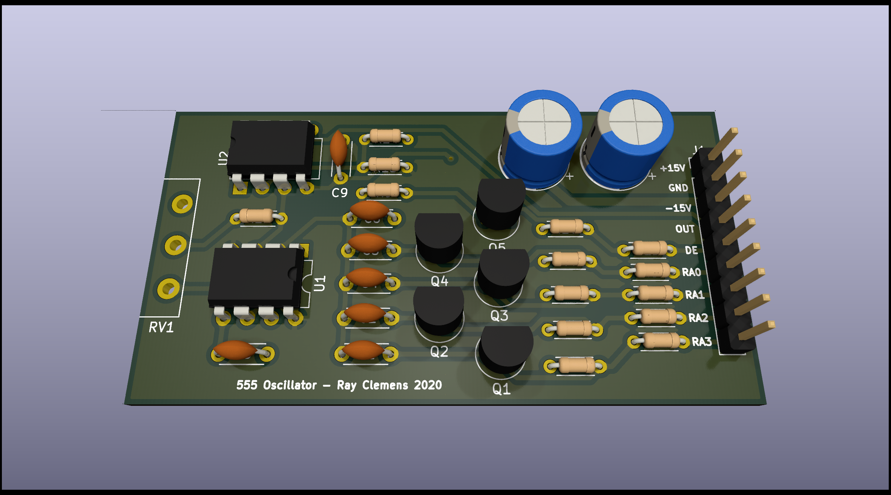

# 555 Synth Module
A single oscillator, multiple-range square wave generator for use in panel-mount synthesizers

## Interface
The main form of user interface with the device is via the potentiometer at the left of the board. This is used for tuning in the currently specified oscillator range. There are five control signals that can also be used (or left floating):
- `DE` - Disables oscillator (on when input left floating)
- `RA[0..3]` - Range selection inputs, changes the capacitance on the 555 oscillator
- `OUT` - The output square wave, uses the 741 op-amp to swing this output from about -14.1V to 14.1V.

### Power
In terms of power supply, I don't see any reason that you could not run this off ±12V (for example in a euro rack device).   
If you do not have a dual rail supply, you can omit the op-amp and just jumper pins 3 and 6 in its location to directly connect the 555's output to the `OUT` pin.

## Schematic
The schematic is relatively straight forward, just a 555 oscillator with a 741 op-amp to make the output swing both positive and negative. The choice of op-amp is not particularly important, as it is only acting as a comparator to increase the output voltage range of the board.   

## Board
The board is designed to have a single (panel mount) pot at one end of the board. This supports the board. At the other end is the connector for power, the output, enable, and range selection. A note about assembly: the ICs are facing opposite directions!
