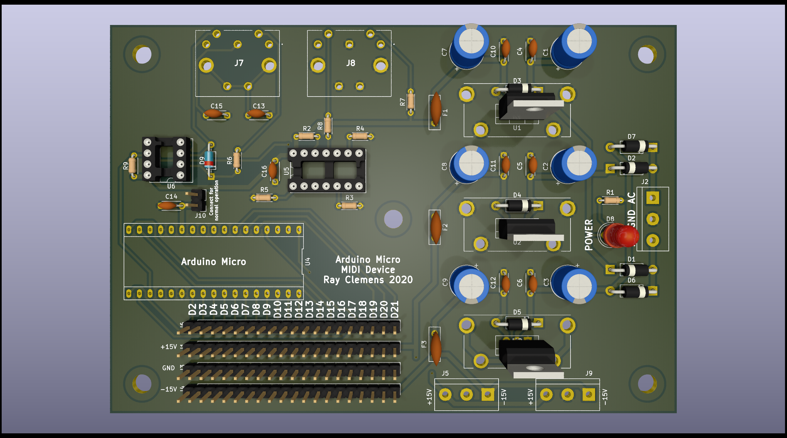

# Arduino_MIDI_Device
A small Arduino-controled MIDI device with built-in dual rail supply.

## Picture

## Power Supply
There is a built in dual-rail power supply. On the right of the board is a terminal block to connect to a stepdown transformer (MIN 24V). The board provides ±15V at 1A (total) on the output which is accessible via two terminal blocks and plenty of pin headers. There is also a 5V supply but this is only for on-board circuitry. The supply is linear, so having the heatsinks is suggested.

## MIDI Interface
There are two MIDI connectors: IN and THRU. The IN is buffered and sent to the THRU connector for chaining more devices. The IN is also sent to the Arduino's hardware RX pin for parsing via the MIDI library. (The MIDI circuitry should be compliant with *(CA-033) MIDI 1.0 Electrical Specification Update [2014]*).

## Digital Outputs
The digital outputs are connected directly to the Arduino's digital IO pins, without any protection (i.e. don't connect them to 15V). Each is labeled using the Arduino digital IO numbering scheme of D[2..21].

## Software
Not written yet, I'll upload it in a few weeks once I get the boards to start working on it.
