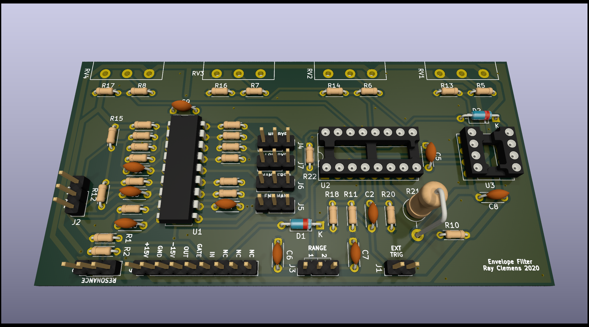

# Envelope Filter
A simple ADSR-controlled VCF for use in panel-mount synthesizers.

## Interface
There are two inputs to the board:
- `IN` - Signal input (±15Vpp max) to be put into the envelope.
- `GATE` - Gate (active high) input for the ADSR envelope. Rising edge is treated as trigger.

 and one output:
 - `OUT` - Signal out of board after envelope has been applied.   

There is a bunch of 3-pin headers for connection to external potentiometers and switches to enable/disable various features like filter bypasses, manual frequency cutoff, and resonance.

### Power
This board is designed to be run off ±15V but with a few resistor swaps, it could be run off ±12V.   

## Schematic
The schematic for the ADSR section of the board is based off the *Soundtronics ADSR Type 1* design. It uses an `AS3310` ADSR control IC to generate the envelope control voltage. This is then fed through a resistor divider into the frequency control on an AS3320 VCF to adjust the cutoff frequency of each section of the filter, which is then sent to the output.  

## Board
The board is designed in a similar manner to the other ones in this repository, where it is supported by the potentiometers' leads. The pots are placed 1 inch apart for easy hole placement when designing the panel.
