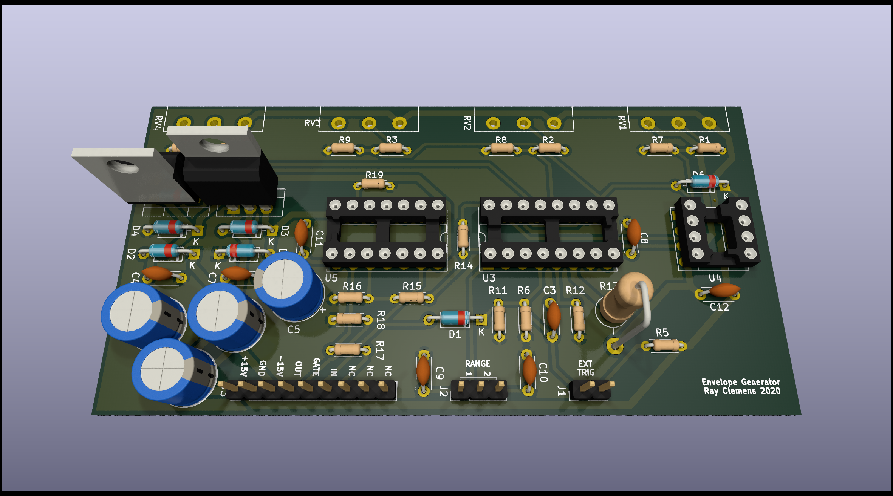

# Envelope Generator
A simple ADSR-controlled VCA for use in panel-mount synthesizers.

## Interface
There are two inputs to the board:
- `IN` - Signal input (±15Vpp max) to be put into the envelope.
- `GATE` - Gate (active high) input for the ADSR envelope. Rising edge is treated as trigger.

 and one output:
 - `OUT` - Signal out of board after envelope has been applied.

### Power
Unlike the other modules in this repository, this board needs a ±15V supply since one of the ICs has its own set of ±12V regulators. (Although, I suppose you could just bypass the regulators if you wanted to run it off ±12V).   

## Schematic
The schematic for the ADSR section of the board is based off the *Soundtronics ADSR Type 1* design. It uses an `AS3310` ADSR control IC to generate the envelope control voltage. This is then fed through a resistor divider into the gain control on an AS3360 VCA to modulate the amplitude of the input signal, which is then sent to the output.  
There is a on-board ±12V power supply for the AS3360.

## Board
The board is designed in a similar manner to the other ones in this repository, where it is supported by the potentiometers' leads. The pots are placed 1 inch apart for easy hole placement when designing the panel. There are two external switches. The first, connected to `J2` is for setting the range of slopes for the envelope (This one is needed or solder a jumper on the appropriate contacts if not wired.) The second switch (`J1`) is for a secondary gate/trigger input. This one is optional.
