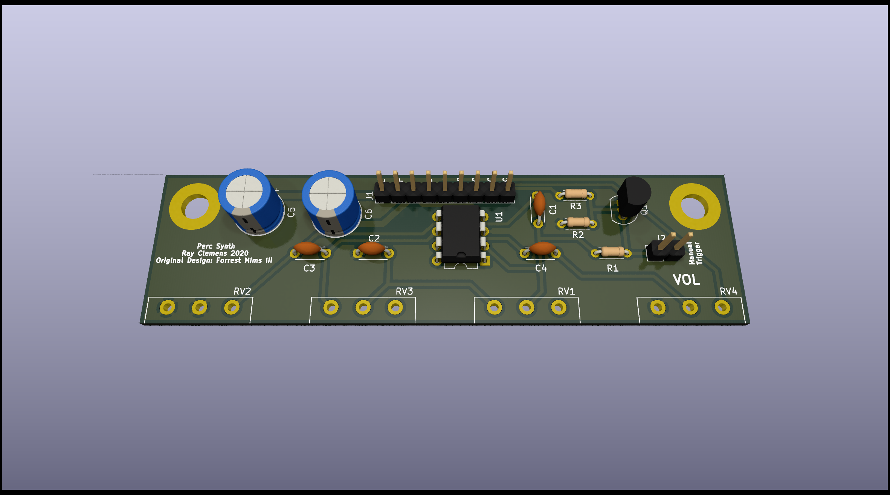

# Percussion Synthesizer
A single op-amp "percussion synthesizer" redrawn from Forrest Mims III's *Getting Started in Electronics*

## Picture

## Interface
There are four potentiometers on the board. The leftmost three are for resonance cutoff (CCW is for cutoff, CW for resonance) and the rightmost potentiometer is gain out.   
This board uses the same connector pin out as the 555 Synth Module and each of the pins is marked on the board. Since not all of the pins were needed, four of them are marked "NC" and are unconnected. The remaining signals are:
- `T` - Triggers sound on both rising and falling edge
- `OUT` - Output waveform, this is connected via a potentiometer and a capacitor internally.

### Power
I run this board off ±15V, however, Mims uses ±9V in his book, so anywhere in that range should be fine. (While testing this circuit before I created the PCBs, I just used a +10v supply fed into a L7805 to create ±5V and that worked just fine).

## Schematic
The schematic is a simple feedback oscillator with three 1M potentiometers to adjust the resonance. The schematic is the same as one in Mims' book, except for the addition of a transistor in parallel with the trigger switch.

## Board
The board really could have been laid out however one wanted, but I chose to put the control potentiometers 1" apart on one side of the board. There are two "mounting holes" that are grounded in case anyone wants to mount the board more securely than just being held on via the potentiometers.
