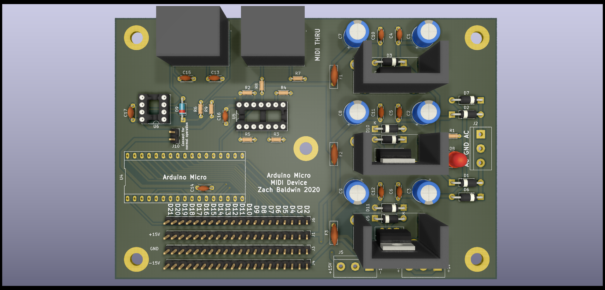

# Arduino_MIDI_Device
A small Arduino-controled MIDI device with built-in dual rail supply.

## Picture

## Power Supply
There is a built in dual-rail power supply. It provides ±15V at 1A (total) on the output which is accessible via two terminal blocks and plenty of pin headers. There is also a 5V supply but this is only for on-board circuitry. The supply is linear, so having the heatsinks is suggested.

## MIDI Interface

## Digital Outputs
