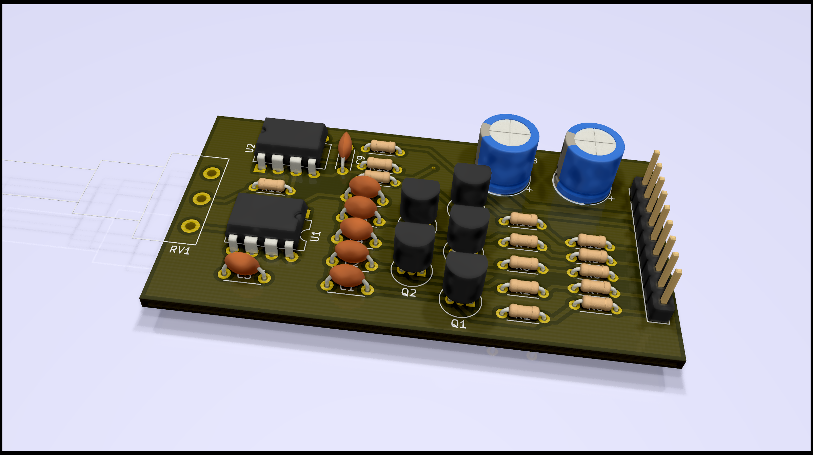

# 555 Synth Module
A single oscillator, multiple-range squarewave generator for use in panel-mount synthesizers

## Schematic
The schematic is realtively straight forward, just a 555 oscillator with a 741 op-amp to make the output swing both positive and negative. Many of the passives do not have specified values since they can be changed by the user to set the frequency and different ranges of the device.

## Board
The board is designed to have a single (panel mount) pot at one end of the board. This supports the board. At the other end is the connector for power, the output, enable, and range selection. A note about assembly: the ICs are facing opposite directions!
