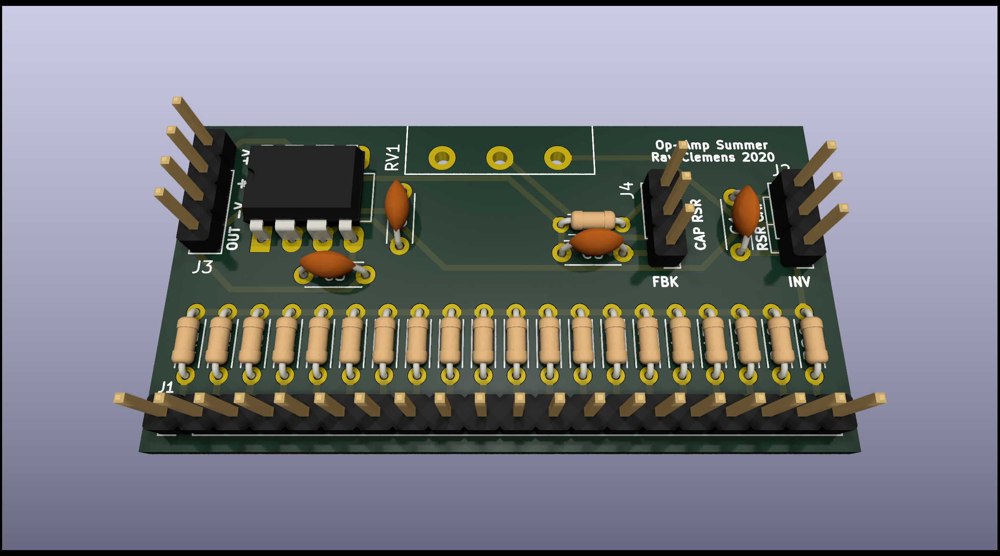

# Multi-mode Op Amp Summer
A three-mode op-amp inverting summing amplifier.

## Interface
Aside from power, there is only one signal on the main connector:
 - `OUT` - Signal out of board after envelope has been applied.   

There are also two 3-pin headers for use in selecting they input component (resistive or capacitive) and the feedback component (resistive or resistive-capacitive). These allow the board to be configured as an inverting summing amplifier, an RC-integrator, and an RC-differentiator.

### Power
The only power requirements are those of the 741 op amp, so basically any plus/minus supply should work (up to ±15V). If you do not have a dual rail supply, this can be powered off a single rail by connecting the `-V` to the low side of your supply, `+V` to the high side, and using a resistor divider (10k-100k should work fine) to get a center voltage to be connected to `GND`.   

## Schematic
The schematic is basically just an inverting summing amplifier that has switches to adjust the various input and feedback components.

## Board
The board is designed in a similar manner to the other ones in this repository, where it is supported by the potentiometer's leads. There is a power connector (left), 20 signal inputs (bottom), and the two option connections on the (right) for the circuit's mode.
